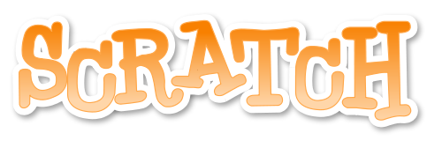

## scratch-hackathon

#Hackathon!

----------

Resources for [Raspberry Pi](http://www.raspberrypi.org/)'s 3rd birthday [Scratch](http://scratch.mit.edu/) Hackathon at [CamJam](http://camjam.me/)'s [#PiParty](https://twitter.com/search?q=%23PiParty)!

Session facilitators:

- David Bower [@rddave](https://twitter.com/rddave)
- Sean McManus [@musicandwords](https://twitter.com/musicandwords)

----------

In this **Scratch Hackathon**, teams of 2 or 3 young programmers will work together to make a Scratch project which interfaces with basic electronic inputs and outputs from [CamJam](http://camjam.me/)'s [EduKit](http://camjam.me/edukit).

The electronic components available are:

- a red, green and yellow LED
- a push button
- a buzzer
   

## Resources

Programmers are provided with sheets covering the following topics:

- [introduction to the GPIO header](http://www.raspberrypi.org/documentation/usage/gpio/)

- [ScratchGPIO Command Guide](http://simplesi.net/scratchgpio/visual-command-guide/)

- [GPIO pinouts from Gadgetoid](http://pi.gadgetoid.com/pinout)

- [Single LED robot antenna project](http://www.raspberrypi.org/learning/robot-antenna/) from Raspberry Pi  

These resources are just to get those unfamiliar with the GPIO header up and running.

### Additional resources that are available:

- Sean has created a web page detailing his three starter example projects, Torch, FizzBuzz and Burglar Alarm (requires EduKit 2) here [www.sean.co.uk/books/raspberry-pi-for-dummies/scratch-gpio.shtm](http://www.sean.co.uk/books/raspberry-pi-for-dummies/scratch-gpio.shtm)  Code for these projects is available.

- [Scratch Cards](Scratch 1.4/ScratchCardsAll-v1.4-PDF)

- See also the various folders in this repository at [github.com/reddog/scratch-hackathon](https://github.com/reddog/scratch-hackathon) for more information and resources.

## WARNING!  GPIO Safety

It is **very important** that the GPIO safety information is reviewed in the Introduction to the GPIO Header document - close attention must be paid to the correct connection of GPIO pins.  Permanent damage can be caused to the Raspberry Pi due to mis-connection of GPIO header pins.

## Saving

Remember to save your work, frequently!  Also remember to shut down the Raspberry Pi properly at the end of the session otherwise the SD card can become damaged, leaving nothing to show & tell!

## (Loose!) Session Plan

Item | Time | Task
--- | --- | ---
1 | 5 mins | Introduction and outline of the Scratch Hackathon - create something **amazing** out of Scratch, GPIO and the CamJam EduKit!  **Hightlight important safety aspect of correctly connecting GPIO pins**
2 | 10 mins | Make some teams!  Self organised teams / different skills / different abilities.  Encourage teams to brainstorm ideas of what sort of **amazing** __Raspberry Pi 3rd birthday__ Scratch GPIO projects could be created!
3 | 5 mins | (If required) Bring together the brainstorming ideas
4 | 1 hr 15 mins | **Hackathon!** 
5 | 10 mins | Final save, proper shutdown of Pis, gather up belongings and move to lecture theatre for show & tell!  

## Show & Tell

The workshop will finish with a **show & tell** in one of the lecture theatres!  After a brief summary of the hackathon, those teams that want (time permitting!) will be asked to give a brief summary of what they learnt and created!!

(Facilitator note:
If required, some sort of random selection of teams to present may be required, for example [www.classtools.net/random-name-picker/](http://www.classtools.net/random-name-picker/) )

## Further Information / After the Event

Gordon Henderson has a basic GPIO example with a single LED where he details why a resistor is also needed, see [projects.drogon.net/raspberry-pi/gpio-examples/tux-crossing/gpio-examples-1-a-single-led/](https://projects.drogon.net/raspberry-pi/gpio-examples/tux-crossing/gpio-examples-1-a-single-led/)

If you want to document your CamJam EduKit GPIO creations, you could use [Fritzing](http://fritzing.org/home/) to draw out your circuits.

----------

These resources can be found at [https://github.com/reddog/scratch-hackathon](https://github.com/reddog/scratch-hackathon)  Download, use, modify, improve and submit a pull request for the benefit of others!

Where possible, this work is licensed under a [Creative Commons Attribution-ShareAlike 4.0 International License](http://creativecommons.org/licenses/by-sa/4.0/).  See individual files for others licence information.
